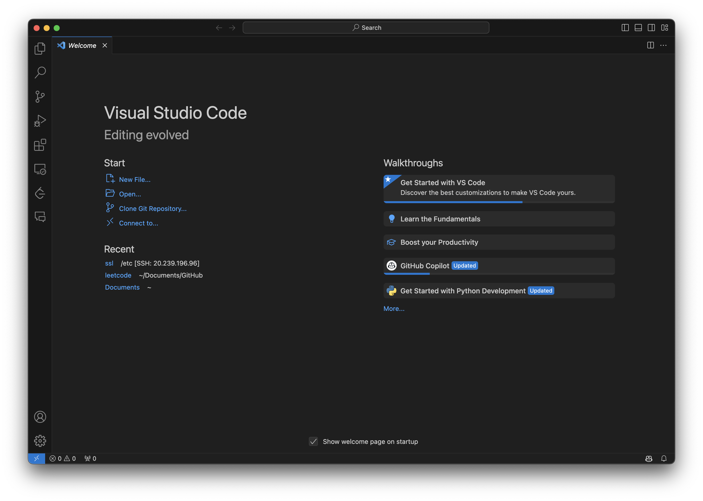
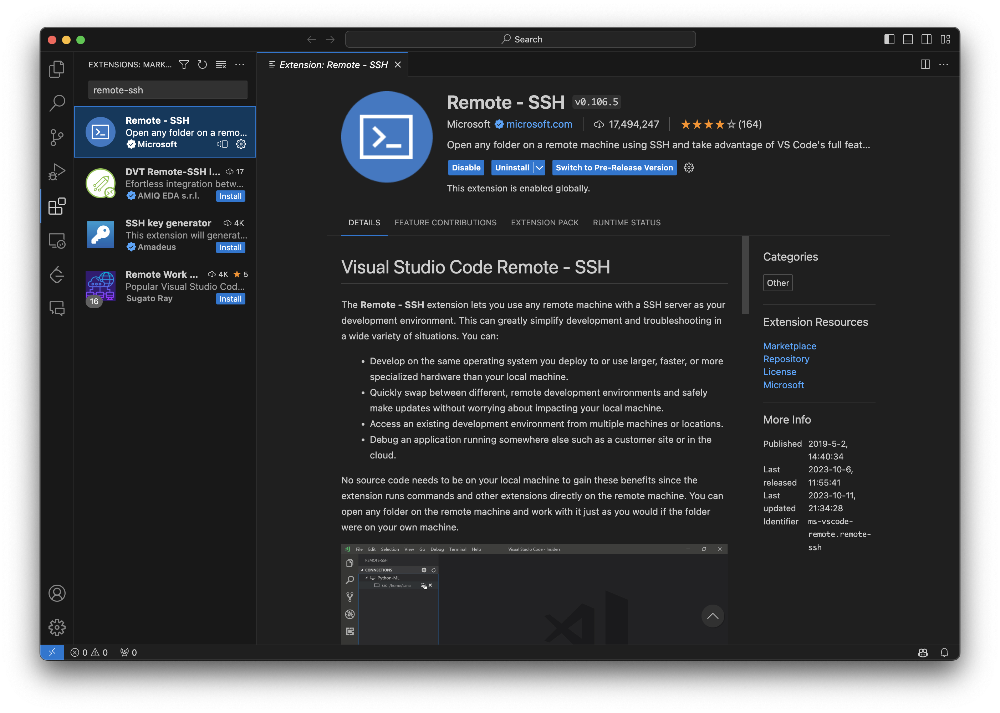
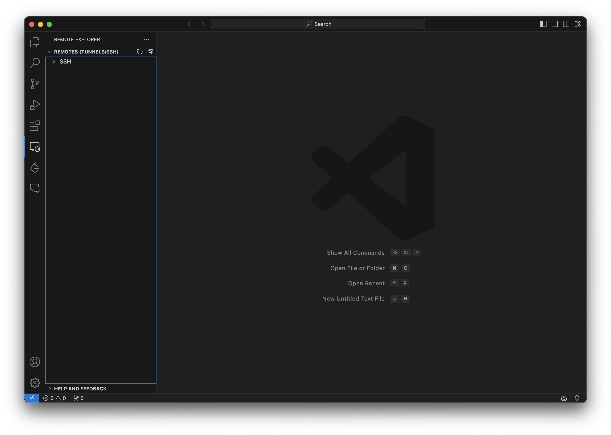
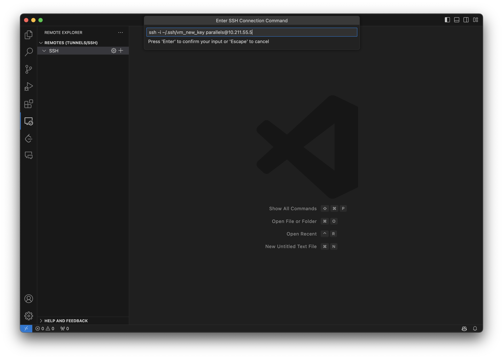
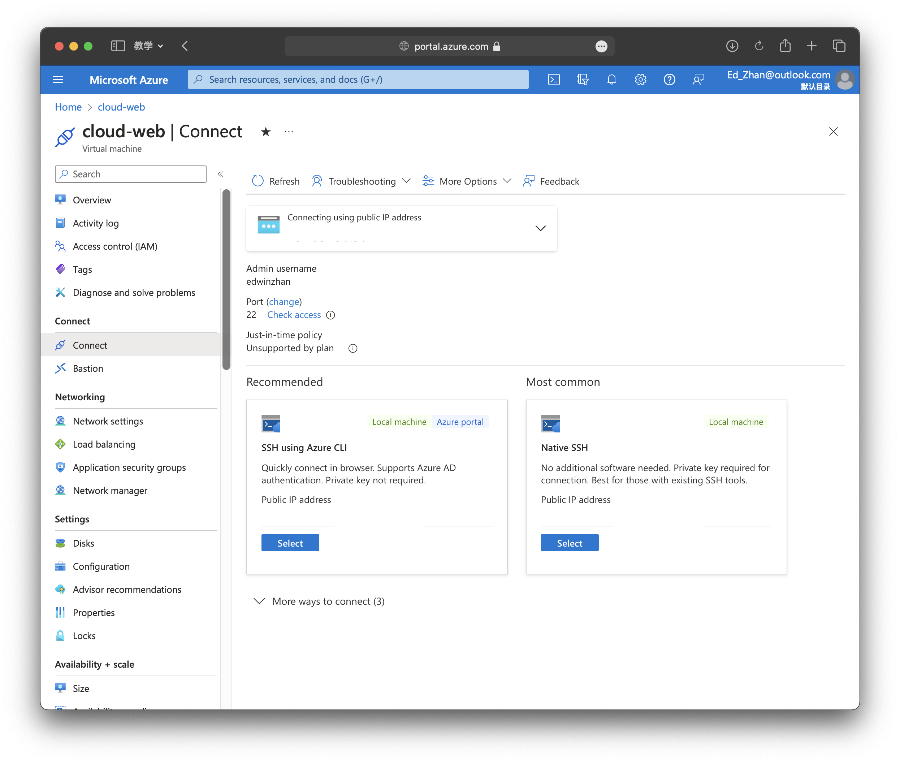
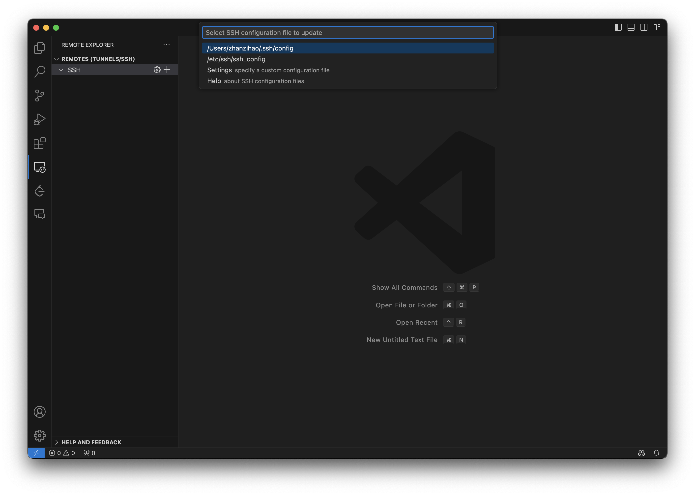
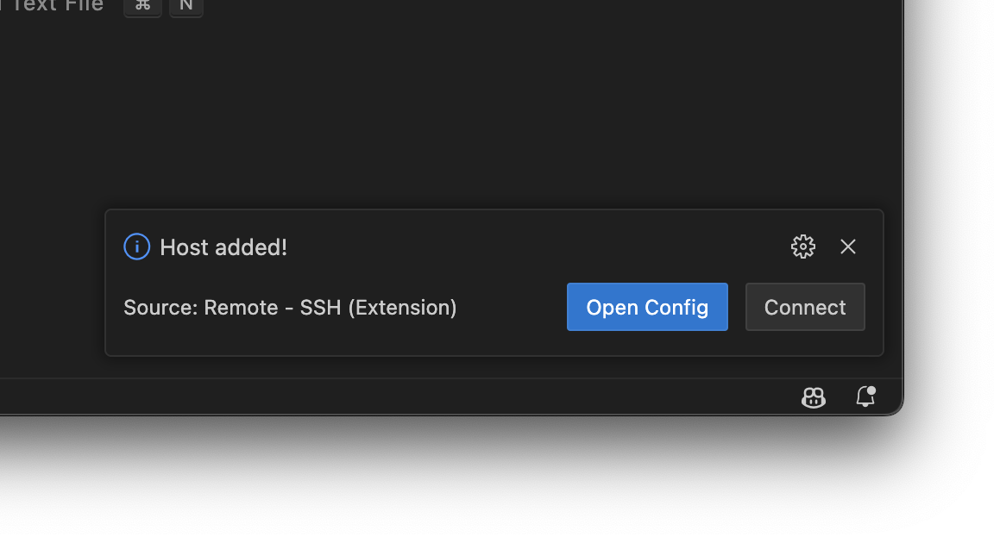

# Connect to Virutal Machine
In last article, we just download a SSH key in our computer, now we need this key to get a remote connection to our VM.
## Download Visual Studio Code
[Visual Studio Code](https://code.visualstudio.com) is a amazing IDE for any type of programming, it has a easy-to-use extension that allows us to make a Romote-SSH connection with Remote Server, and it also allows us upload or download files between our local file system and the remote server easily. 

**Open** your downloaded VSCode, it should be like this:



## Add Remote-SSH Extension
On the left side bar, you can see there is a icon with 4 blcoks, click it, and you can find any extensions you want. For here, we search `Remote-SSH`, then click **Download**.


On the left side bar, open the small computer icon, which is the Remote-SSH extension, and you can see a UI like this:


## Create a folder for SSH key files
Next, **move** your dowloaded ssh key files into such directory:
* On **Mac:**
Open Terminal and use:
```bash
mkdir ~/.ssh
open ~/.ssh
```
It will create a folder named .ssh and show this folder in finder.

Then move your ssh key files into this directory.
* On **Windows:**
create a folder named **.ssh** under **User/Yourusername/** directory.

Then, move the ssh key files into this directory.

## Connect by SSH key
Back to VSCode, go to **Remotes -> SSH -> 'add' Button** and input your remote 
connection link as following:
```bash
ssh -i path/to/your/SSHkeyfilname.pub yourusername@Public IP address
```


You can see your Public IP address on your **Azure Portal->Resources->your VM->Overview** and copy it. You can also find your username and IP address in **Connect->connect**:


After stroke enter, VSCode will ask you to add the path of `config` file. Reminds that the `config` file should be the **same** directory  you save your SSH key file. You can specify your path to the folder by clicking **Settings.**


By pressing <kbd>Enter</kbd>, a small window will pop out from the bottom-right of VSCode:

Click `Connect`

## Have a connection erro?
Go to **Terminal->New Terminal**
You may need to use following code to copy your key to your VM:
```bash
ssh-copy-id -i path/to/your/SSHkeyfilname.pub yourusername@Public IP address
```
To check if the connection is successful, you can see if  your host IP address shown on the footer of VSCode:

Next, Go to **Terminal->New Terminal**


If you see this page, you are successfully connect to your Azure VM!

And we will set our HTTP server in next article->

