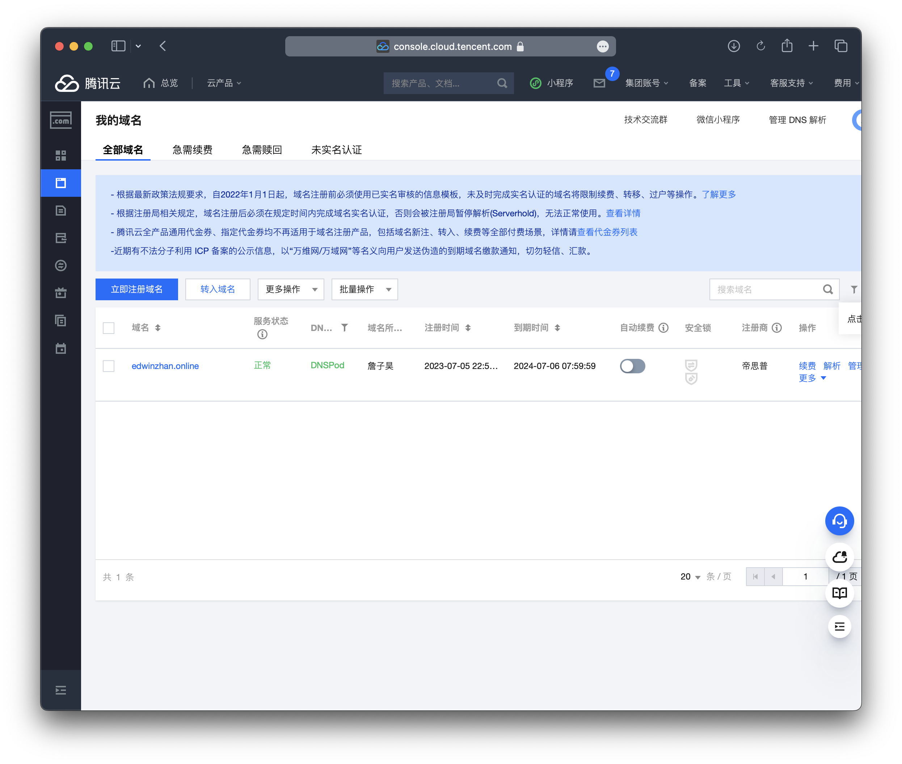
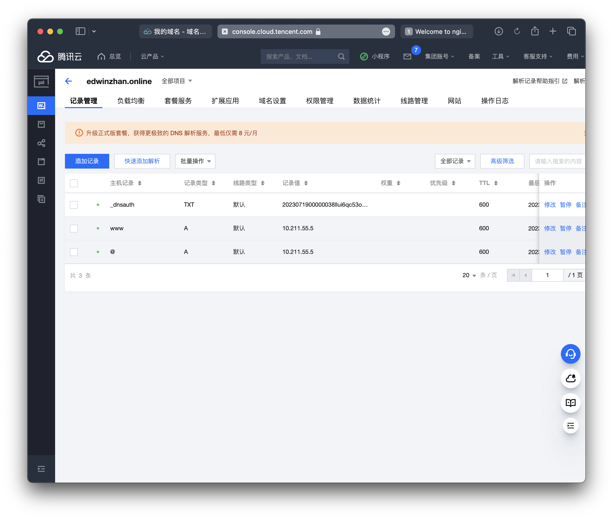
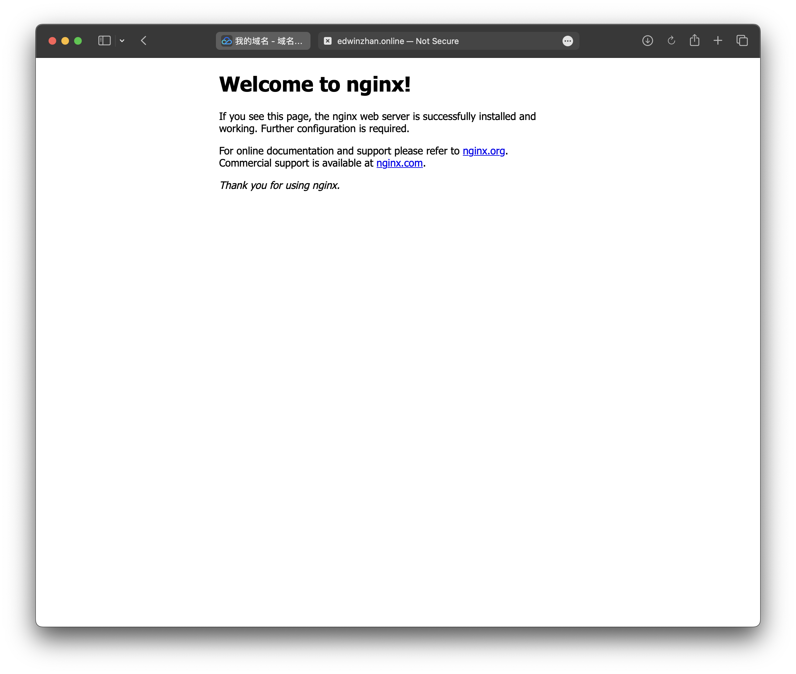

# Setup your domain name

## Choose a domain name you like!
Just follow these links to buy your favorite domain name. The name not end with **.com, .org, .net** will be cheap, may not choose **.cn or .com.cn**

>* [GoDaddy](https://www.godaddy.com/offers/brand/new?isc=USGDYBIN1&msclkid=f5040b0d1b3a1a7f5ad36e218ede7387&utm_source=bing&utm_medium=cpc&utm_campaign=en-us_corp-core_sem_bh_b_x_aware-consider_x_pros_us_exact-stag_001&utm_term=godaddy&utm_content=%5Bgd%5D)
>* [Domain.com](https://www.domain.com)
>* [Google](https://domains.google)
>* [Aliyun阿里云(for china mainland)](https://cn.aliyun.com)
>* [TencentCloud腾讯云(for china mainland)](https://cloud.tencent.com)
>* Others you may like…..

I can not teach you how to buy domain names in all websites, but you **should have a control center** of your domain name like this after you buy it. (TencentCloud):

OK.
:::warning
Make sure you get your own domain name and you can manage it, it is very important.
:::
## Setup Nginx configuration file.

**Back to the Terminal of your VM.**

Just **remember** these simple commands, and you can use Linux system fluently.
```bash
cd //direct to a directory
ls //list all files or directories in current directory.
vim //using the famous editor 'vim'
```
`cd` to the root
```bash
cd
```
Go to `/etc/nginx/`
```bash
cd /etc/nginx/
```
List all files
```bash
ls //you will see such files:
conf.d        fastcgi_params  koi-win     modules-available  nginx.conf    scgi_params      sites-enabled  uwsgi_params
fastcgi.conf  koi-utf         mime.types  modules-enabled    proxy_params  sites-available  snippets       win-utf
```
A blue name means a directory, a white means a file
The **Configuration file** is under the directory `sties-available`. So `cd` to the 	`sites-available`
```bash
cd /etc/nginx/sites-available
ls //show files:
default
```
Edit file defualt by using `vim`,  `nano`, etc, I will use `nano`.(:D)
```bash
nano default
```
After command run, you can see a lot of lines of cmments or codes, which is correct, If not, check If you type wrong or doing something else.
```nano
  GNU nano 6.2                                                           default                                                                     
##
# You should look at the following URL's in order to grasp a solid understanding
# of Nginx configuration files in order to fully unleash the power of Nginx.
# https://www.nginx.com/resources/wiki/start/
# https://www.nginx.com/resources/wiki/start/topics/tutorials/config_pitfalls/
# https://wiki.debian.org/Nginx/DirectoryStructure
#
# In most cases, administrators will remove this file from sites-enabled/ and
# leave it as reference inside of sites-available where it will continue to be
# updated by the nginx packaging team.
#
# This file will automatically load configuration files provided by other
# applications, such as Drupal or Wordpress. These applications will be made
# available underneath a path with that package name, such as /drupal8.
#
# Please see /usr/share/doc/nginx-doc/examples/ for more detailed examples.
##

# Default server configuration
#
server {
        listen 80 default_server;
        listen [::]:80 default_server;

        # SSL configuration
        #
        # listen 443 ssl default_server;
        # listen [::]:443 ssl default_server;
        #

^G Help         ^O Write Out    ^W Where Is     ^K Cut          ^T Execute      ^C Location     M-U Undo        M-A Set Mark    M-] To Bracket
^X Exit         ^R Read File    ^\ Replace      ^U Paste        ^J Justify      ^/ Go To Line   M-E Redo        M-6 Copy        ^Q Where Was
```
To be more clear I will show my config file that do not have comments:
```text
server{
        listen 80;
        listen [::]:80;
        server_name edwinzhan.online www.edwinzhan.online; //add you own domain names. www.example.com or example.com
} 
```
Add some of them, but do not change other things. Save and qiute by following guides it provided.

**Well down!** After doing this, back to Terminal, restart Nginx
```bash
sudo systemctl restart nginx
```
Check the status:
```bash
sudo systemctl status nginx
```
**Now**, try to access your VM by simply input your **Public IP Address**, if it shows:


**Your are success to access your Nginx (A web server) by Internet!**
So, where is this page comes from? `/var/www/` is a directory Nginx provides us, you can upload your website files here, it is a default root for our website. You can see the source code of defualt page by:
```bash
cd /var/www/html/
ls //list files:
index.nginx-debian.html
```
And
```bash
nano index.nginx-debian.html
```
:::tip
**By the way, we will connect this directory with Github later.** Now we should redirect our domain name to our IP address.
:::

## Add host records.
Go to your **control center** of domain name. And go `resolution`

Whatever which type of **control center** you have, it should contains following settings:
>* Host record
>* Record type 
>* Router type
>* Record Value
>* TTL
>* ...

By accessing `www`, we need to add tow records

>* **Host record:** www
>* **Record type:** A
>* **Router type:** Default
>* **Record value:** Your public IP address
>* **TTL:** 600

>* **Host record:** @
>* **Record type:** A
>* **Router type:** Default
>* **Record value:** Your public IP address
>* **TTL:** 600


Others are optional.

After you did this, you can **use your domain name** to access the Nginx default page! 
::: warning
Reminds! Using `http://`instead of `https://`
:::


***Here we go!***

