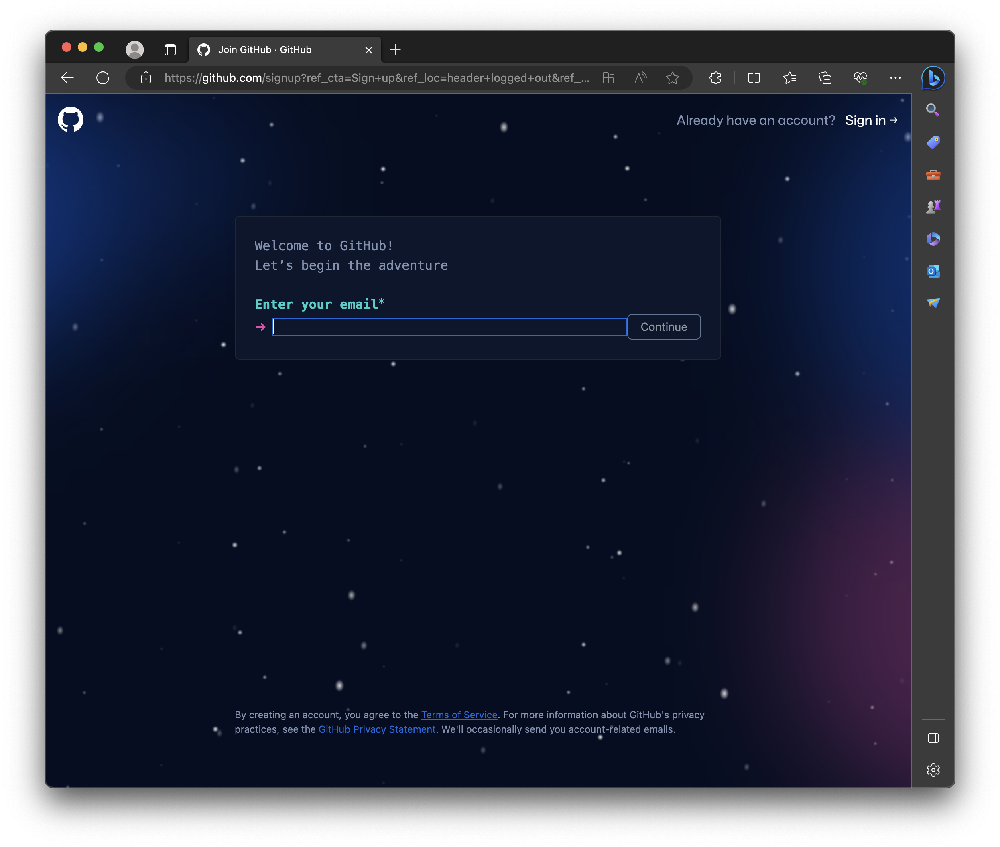
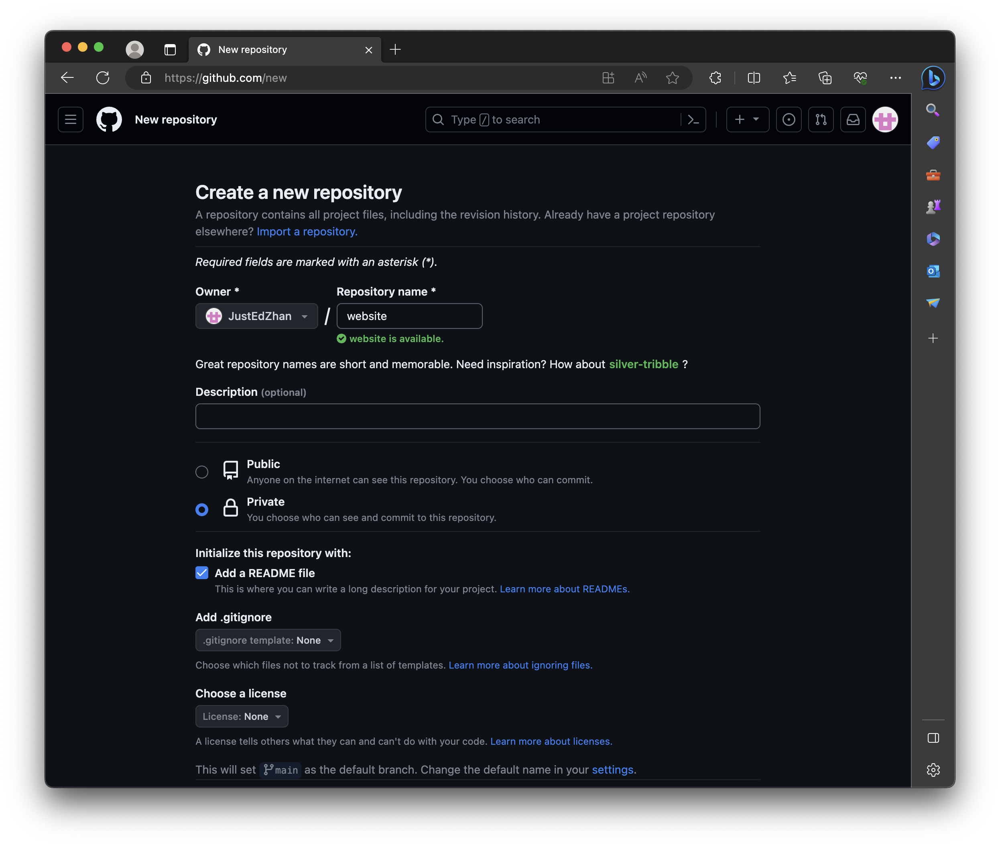
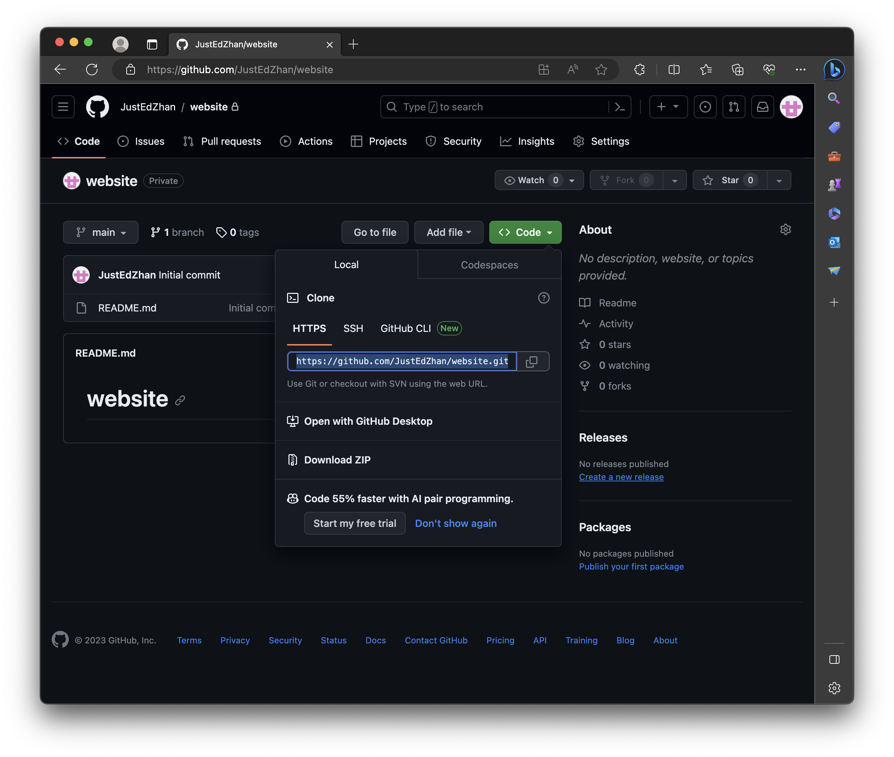

# Show your first HTML page!

**Congratulations!** Your exploration of website setup is nearing its conclusion. Wasn't this process quite straightforward? This article will use **GitHub** and **Git** technologies to upload and update your website, showcasing your first webpage code on the homepage!

## Registar GitHub
Go to [GitHub](https://github.com/), click `Sign Up`:


Follow the sign up instructions:


click `Create new repository`


simply fill the spaces and set your repository to be **Private**


Copy the link in code->local:


OK, then we back to our VM Teminals, and install **Git**:
```bash
sudo apt update
sudo apt install git
```

Then go to the root directory of our website:
```bash
cd /var/www/
ls:
html
```

Now, you should see a `html` directory, this is the defualt directory of Nginx.  By the way, **Clone your repository** with a name of `web` (or your preffered name):

```bash
git clone https://github.com/yourusername/yourrepo.git web
```
After you using the command `mkdir web` and `ls` all files in directory, you will find the new directory you just made!

