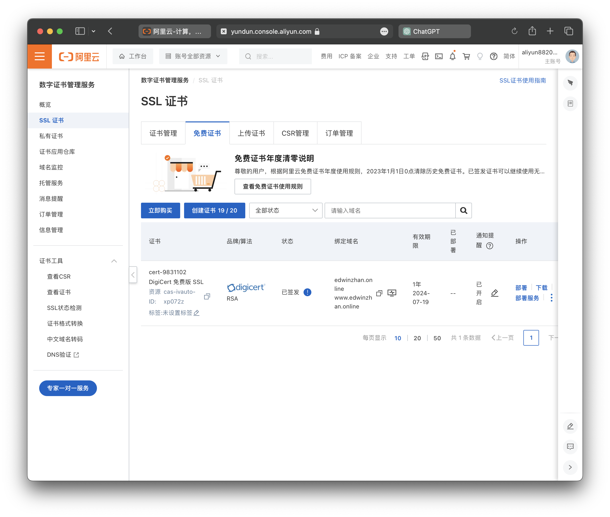
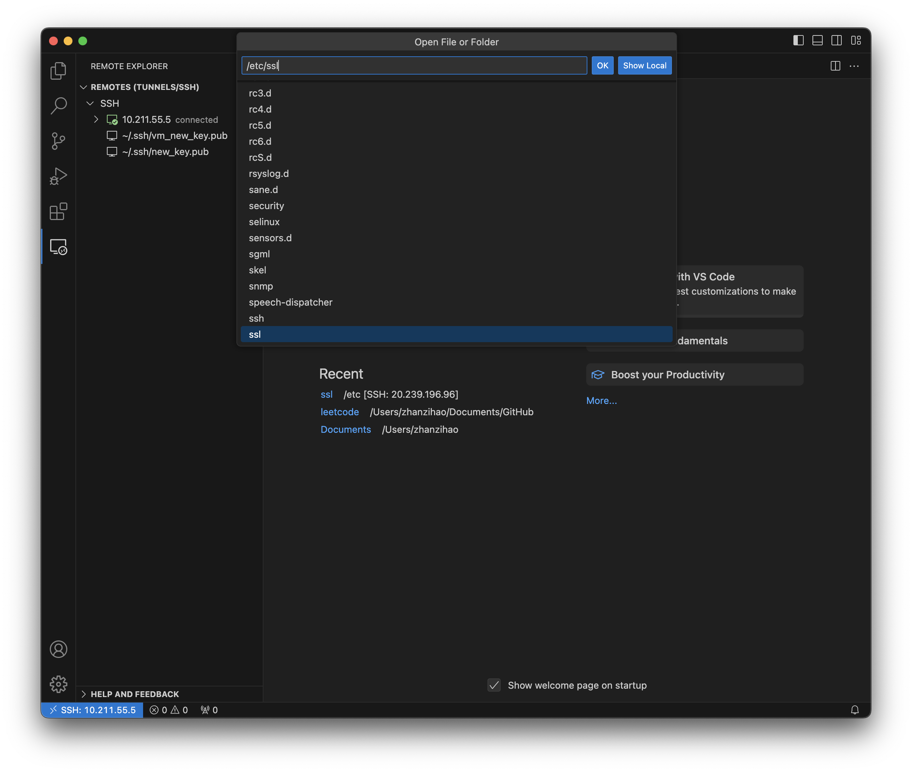
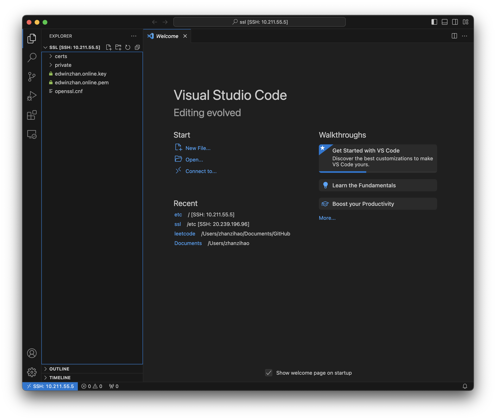

# Setup SSL and Https
**HTTPS incorporates the security provided by SSL/TLS, which encrypts the data transferred between a web browser and a web server to ensure it can't be intercepted or tampered with by third parties.**
Generally, If you don't want your Website to be "Not Secure", you need this.

## Get a SSL Certificate
Similar to a domain name, you need an SSL Certificate from sellers, and you need a **management station** to handle it. An SSL Certificate should be bound to your domain name.


After you obtain a SSL certificate, you need to download your certificate. Since we are using Nginx, there are two files: one with a .pem extension and another with a .key extension.**(pem/key)**

## Setup Nginx Service
OK, now you should have **two files** related to your SSL certificate, which is awesome. Next, we need to go back to **VSCode** and set up our **Nginx service.**

::: tip
Remember, using `sudo -i` to switch to the root user can make your life easier!
:::

Now, we need to upload our `.pem` and `.key` files to our VM. Click the **Open... icon** on the welcome page of VSCode or go to **File->Open Folder...** on the top of the screen:

Then search `/etc/ssl/`, click `OK`.


Now you can see a **File directory system** is shown on the left sidebar, so you can simply **drag your key/pem files into the *ssl* directory**. That's reason why I choose VSCode to connect our VM, it is simple and readable.


After you finish uploading the files, go to our sites-available default file:
```bash
nano /etc/nginx/sites-available/default
```

Check your content and copy the code,  you should have a similar layout with mine, **except the server_name and the path to your ssl_certificate.:**
```bash
server{
        listen 80;
        listen [::]:80;
        server_name edwinzhan.online www.edwinzhan.online;

        rewrite ^(.*)$ https://$host$1 permanent;

        server{
                listen 443 ssl defualt_server;
                        listen [::]:443 ssl default_server;
                server_name ewinzhan.online www.edwinzhan.online;
                        ssl_certificate /etc/ssl/edwinzahn.online.pem;
                        ssl_certificate_key /etc/ssl/edwinzhan.online.key;

                        ssl_session_timeout 5m;
                ssl_protocols TLSv1 TLSv1.1 TLSv1.2;
                        ssl_cipher ECDHE-RSA-AES128-GCM-SHA256:HIGH:!aNULL:!MD5:!RC4:!DHE;

                        ssl_prefer_server_ciphers on


        location /{
                root /var/www/web;
                index /main/main.html;
        }

} 
```
Restart Nginx:
```bash
sudo systemctl restart nginx
```

Now you successfully setup your SSL certificate!

I will explain the `location /` part in next article.

