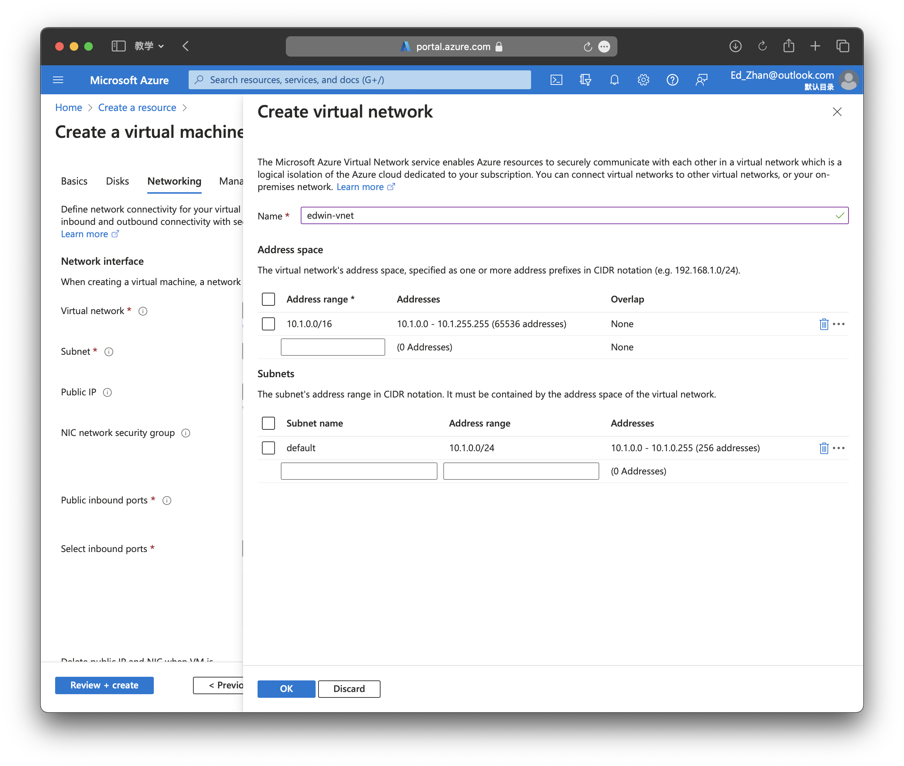
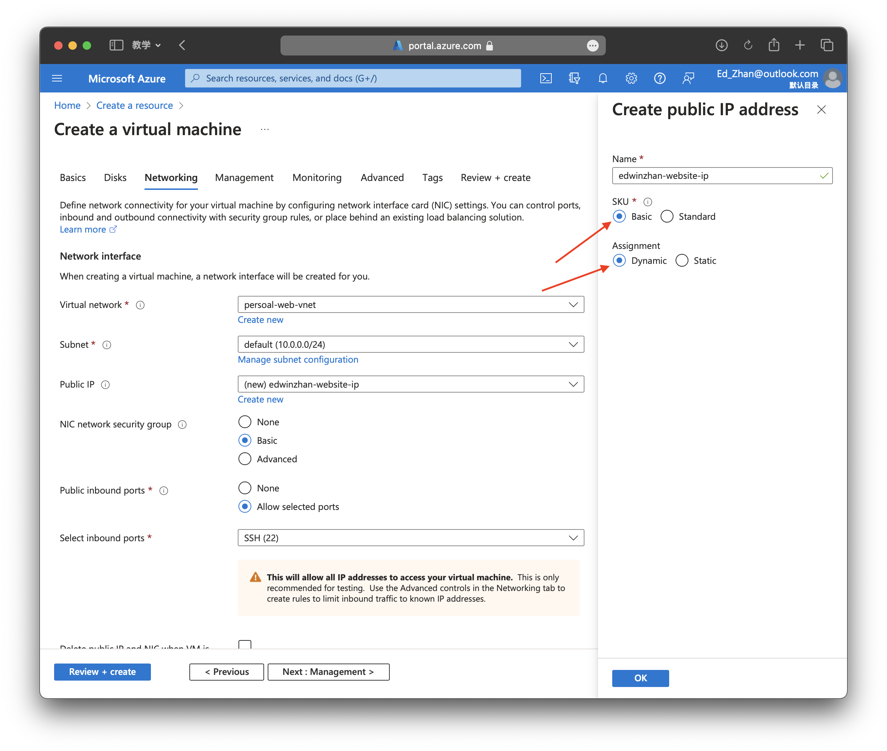

# Start with Azure Virtual Machine

## Get an Azure Account
**Student**
[Go to Azure Student](https://azure.microsoft.com/en-us/free/students/)
Click 'Start free', you may need your education email for verification, `example@yourschool.edu`

**Not a student ?**
[Go to Microsoft Azure official website](https://azure.microsoft.com/en-us/)
Click 'Free account', After the decription due, you need to pay for the Virtual Machine

## Login to the Microsoft Azure
Go to
[Microsoft Azure](https://portal.azure.com)
Then login with your azure account

**After login Successfully**, you will see an Azure portal like this

and click  **Create a resource**

## Create a virtual machine
You will see the icon of virtual machine then click `Create`

In this page we will set up our virtual machine

**The inputs needed:**

Here we should choose `Authentication type` as **SSH public key**, which is a encoded key for us, so we can  have a remote connection with cloud virtual machine. The `Username` is the username of this machine, and the `Key pair name` is the name of your ssh key, they have tow files. Then go to `Disks`

For free account, we can choose 64GiB P6 disk, which is free for free account.Extra spaces may have extra costs

Here, we will create a new `Virtual network` click **Create new**. and input your prefferd name, click **OK**.

Here, we will create a `Public IP` address, select `Basic` and `Dynamic`. Don't be worry about dynamic Public IP address. In fact,  Microsoft won't change your IP address. Using static Public IP address will have extra costs. (If the option is disabled, you should check your Availability options in **Baiscs**)

**OK, well down.** We just finish some basic settings for our VM, which is enough, you can learn other settings from the Internet or Microsoft official. In here, we can just click `Review + create` button at the bottom left. 

:::danger
**Don't forget to download your SSH key!**
:::

After creation finished, go to `Resources` and click your Virtual Machine, the Overview Page should like this:

:::info
We just finish creating the VM!
:::

## Open ports
In order to establish a connection to the internet, we need to open ports **80, 8080, and 443**, we can do this under the **Settings -> Networking**

OK, Let's go and connect our VM!